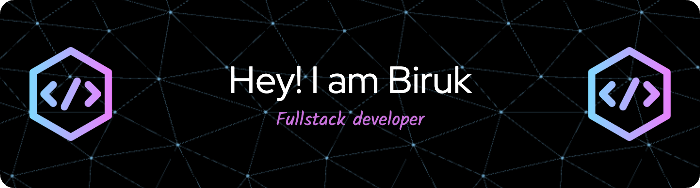

<h1 align="center">Hi 👋, I'm Biruk Mekonnen</h1>
<h3 align="center">A passionate full-stack developer from Ethiopia. Welcome to my GitHub profile!</h3>
</img>

  

- 🌱 I’m currently learning **Python**

- 💬 Ask me about **Flutter, Node + Ts/Js, SQL/NoSQL**

- 📫 How to reach me **birukmekonnent@gmail.com**

<h3 align="left">Connect with me:</h3>

<h3 align="left">Languages and Tools:</h3>

  <!-- Mobile & Frontend -->
  
  
  
  
  
  
  

  <!-- Backend -->
  
  
  
  

  <!-- DevOps & Cloud -->
  
  
  
  

  <!-- Databases -->
  
  
  

  <!-- Testing -->
  
  

  <!-- Tools -->
  
  
  
  

  <!-- Design -->
  
  
  
  

